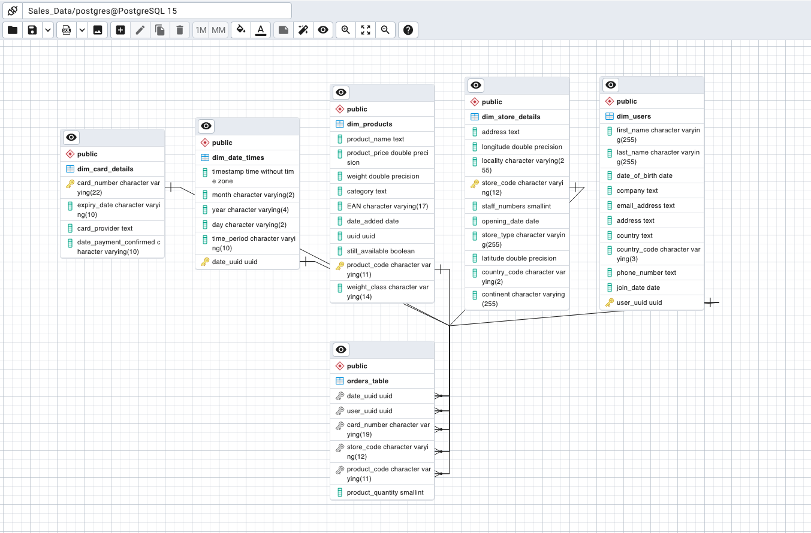
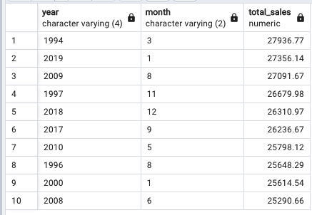

# MULTINATIONAL RETAIL DATA CENTRALISATION

In this document, the discussed project is the Multinational Data Centralisation project, which is a comprehensive project aimed at transforming and analysing large datasets from multiple data sources. By utilising the power of Pandas, the project will clean the data, and produce a STAR based database schema for optimised data storage and access. The project also builds complex SQL-based data queries, allowing the user to extract valuable insights and make informed decisions. This project will provide the user with the experience of building a real-life complete data solution, from data acquisition to analysis, all in one place. 

- Developed a system that extracts retail sales data from five different data sources; PDF documents; an AWS RDS database; RESTful API, JSON and CSV files.
- Created a Python class which cleans and transforms over 120k rows of data before being loaded into a Postgres database.
- Developed a star-schema database, joining 5 dimension tables to make the data easily queryable allowing for sub-millisecond data analysis
- Used complex SQL queries to derive insights and to help reduce costs by 15%
- Queried the data using SQL to extract insights from the data; such as velocity of sales; yearly revenue and regions with the most sales. 

## SETTING UP pgAdmin4

The first step is to set up a new database within pgadmin4, and name it sales_data. This is the database that will store the extracted information. Here, the STAR based schema will be created and the information will be managed. 

## data_extraction.py

The file  contains a class called DataExtractor used to extract information from a variety of sources (PDF documents, an AWS RDS database; RESTful API, JSON and CSV files). Each piece of information that will be used is extracted from a different source and hence it will need a different method to be collected.

- Relational Database Service (RDS): Making use of an instance of the DatabaseConnector, the method [read_rds_table] uses an engine to extract a specific table from the RDS.
- PDF: Using tabula to extract the information from the pdf url, and concatenating all pages, a dataframe is created. The method is named [retrieve_pdf_data]
- RESTful API: Making use of requests, the API is accessed and the information is extracted and managed. The methods for this use are [list_number_of_stores], [retrieve_stores_data] and [extract_date_details]
- s3 CSV: Making use of the boto3 package, it extracts a CSV file that is read with pandas. [extract_from_s3].

## database_utils.py

The file  contains a class called DatabaseConnector used to interactuate with different RDS databases. It contains different methods to read credential files, create engines, and methods to navigate through the information of the databases such as [list_db_tables]. It also contains a method that uploads tables to the main database. 

## data_cleaning.py

The file  contains a class DataCleaning, with various methods to clean data from many different sources. Each method is inputted data collected with the data extractor and cleaned accordingly to its own needs. 

At the end of the file, a if __name__ == '__main__' block contains the process to extract, clean and upload the data to the relational database:

if __name__ == '__main__':

    data_extractor = DataExtractor()
    data_cleaner = DataCleaning()
    database_connector = DatabaseConnector()

    '''User data'''
    user_data = data_extractor.read_rds_table(table_name= 'legacy_users')
    clean_user_data = data_cleaner.clean_user_data(user_data= user_data)
    database_connector.upload_to_db(dataframe= clean_user_data, table_name= 'user_data')

Hence, once this is run, the postgre database can be accessed and all the information can be managed via SQL commands.

## Creating the DATABASE SCHEMA

The file  contains all the SQL commands to build the STAR-based database.

To build a correct schema, many datatypes have had to be changed. The greatest part of the data was in format 'text', and so it had to be changed to the correct datatype:

| dim_user_table | current data type | required data type |
| -------------- | ----------------- | ------------------ |
| first_name     | TEXT              | VARCHAR(255)       |
| last_name      | TEXT              | VARCHAR(255)       |
| date_of_birth  | TEXT              | DATE               |
| country_code   | TEXT              | VARCHAR(?)         |
| user_uuid      | TEXT              | UUID               |
| join_date      | TEXT              | DATE               |

For the products, a better way to separate them by weight was to add a new column called weight_class, and the values were distributed between light, mid sized, heavy and truck required according to the table below:

| weight_class | weight range(kg) |
|--------------|-----------------|
| Light        | < 2             |
| Mid_Sized    | >= 2 - < 40     |
| Heavy        | >= 40 - < 140   |
| Truck_Required | >= 140        |

In order to correctly build the database schema, the primary keys were added to each of the tables prefixed with dim. There is one of the headers in the orders_table that exists in one  dim-prefixed table. 

On the other hand, the foreign keys in the orders_table were created to reference the primary keys in other tables. The foreign key constraints were created to reference the primary keys of the other table.

These foreign key constraints stablish a relationship between a column in the child column (dim tables) and a column in the parent table (orders_table or truth table). This will ensure that the values in the foreign key column of the child table always correspond to existing values in the primary key column of the parent table, or to a null value in the foreign key.

## BUSINESS SCENARIO

The resulting database schema is:

The  file contains the necessary queries to obtained the answers given here.

### TASK 1:
The Operations team would like to know which countries we currently operate in and which country now has the most stores. Perform a query on the database to get the information.

| country | total_no_stores |
|---------|----------------|
| GB      | 266            |
| DE      | 141            |
| US      | 34             |

The country containing the most stores is Great Britain, with 266 stores.

### TASK 2:
The business stakeholders would like to know which locations currently have the most stores. They would like to close some stores before opening more in other locations. Find out which locations have the most stores currently. 

The 7 locations containing the most stores currently are the following:

| locality       | total_no_stores |
|----------------|----------------|
| Chapletown     | 14             |
| Belper         | 13             |
| Bushley        | 12             |
| Exeter         | 11             |
| High Wycombe   | 10             |
| Arbroath       | 10             |
| Rutherglen     | 10             |

## TASK 3:

Query the database to find out which months typically have the most sales.

August is the month with the most sales, followed by January and October. The last month is February, followed by April and November.

| month | total_sales        |
|-------|--------------------|
| 8     | 673295.6799999983  |
| 1     | 668041.4499999986  |
| 10    | 657335.8399999985  |
| 5     | 650321.4299999985  |
| 7     | 645741.699999999   |
| 3     | 645462.9999999991  |
| 6     | 635578.9899999985  |
| 12    | 635329.0899999985  |
| 9     | 633993.6199999992  |
| 11    | 630757.0799999996  |
| 4     | 630022.7699999996  |
| 2     | 616452.9899999991  |

## TASK 4:
The company is looking to increase its online sales. They want to know how many sales are happening online vs offline. Calculate how many products were sold and the amount of sales made for online and offline purchases.

## TASK 5:
The sales team wants to know which of the different store types is generated the most revenue so they know where to focus. Find out the total and percentage of sales coming from each of the different store types.

## TASK 6:
The company stakeholders want assurances that the company has been doing well recently. Find which months in which years have had the most sales historically.

By selecting information from orders_table, dim_products, and dim_date_times, it is possible to retrieve the necessary information to find the best sales month for each year. 

## TASK 7:
The operations team would like to know the overall staff numbers in each location around the world. Perform a query to determine the staff numbers in each of the countries the company sells in.

## TASK 8:
The sales team is looking to expand their territory in Germany. Determine which type of store is generating the most sales in Germany.

## TASK 9:
Sales would like to get an accurate metric for how quickly the company is making sales.
Determine the average time taken between each sale grouped by year.

 