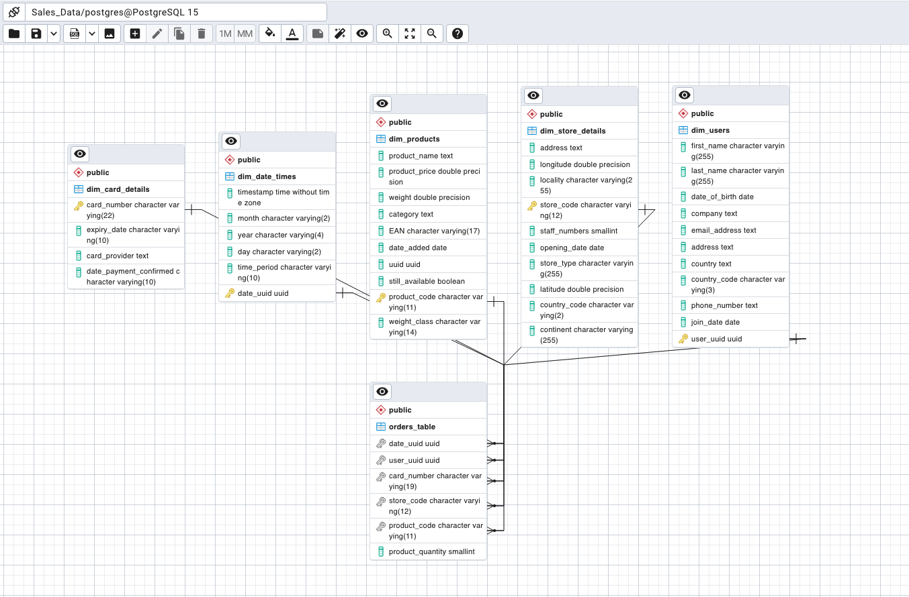
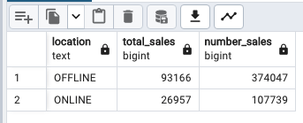
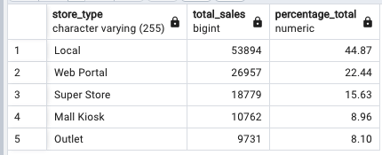
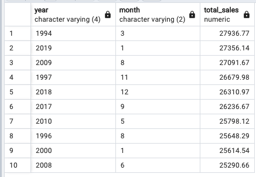
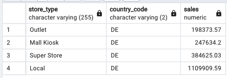
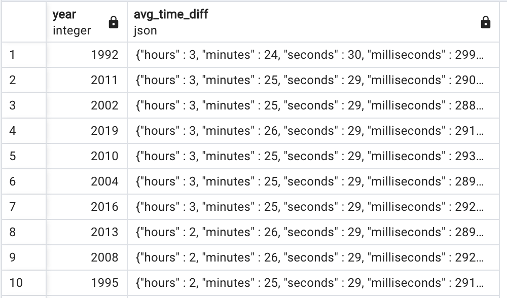
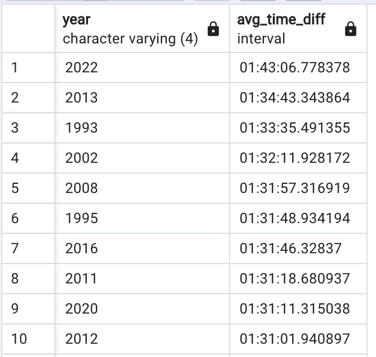
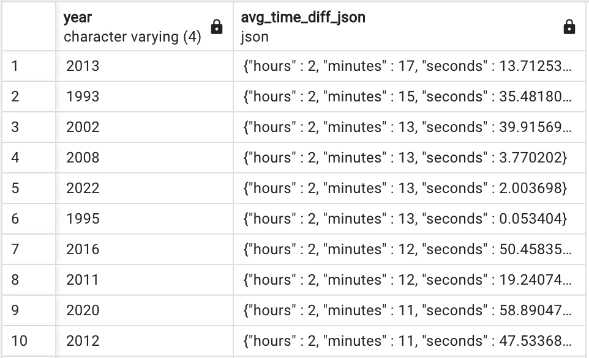

# Sales Data queries
This is a file that contains the queries made in the Sales_Data Database in PgAdmin.

## TASK 1:

For the first task, the datatypes from the orders_table should be changed:

|   orders_table   | current data type  | required data type |
|------------------|--------------------|--------------------|
| date_uuid        | TEXT               | UUID               |
| user_uuid        | TEXT               | UUID               |
| card_number      | TEXT               | VARCHAR(?)         |
| store_code       | TEXT               | VARCHAR(?)         |
| product_code     | TEXT               | VARCHAR(?)         |
| product_quantity | BIGINT             | SMALLINT           |

The queries for these changes were:

ALTER TABLE orders_table
ALTER COLUMN date_uuid TYPE AS UUID
USING date_uuid::UUID;

ALTER TABLE orders_table
ALTER COLUMN user_uuid TYPE AS UUID
USING user_uuid::UUID;

ALTER TABLE orders_table
ALTER COLUMN product_quantity TYPE AS SMALLINT;

In order to get the largest number in the column, the following query was used in all cases where 
this needed to be done:

SELECT MAX(LENGTH(card_number)) AS max_length FROM orders_table;

This query returned the maximum length of the card_number (19), store_code(12), product_code(11), and their type was changed using:

ALTER TABLE orders_table
ALTER COLUMN card_number TYPE VARCHAR(19);

## TASK 2

The changes to implement here were the following:

| dim_user_table | current data type | required data type |
| -------------- | ----------------- | ------------------ |
| first_name     | TEXT              | VARCHAR(255)       |
| last_name      | TEXT              | VARCHAR(255)       |
| date_of_birth  | TEXT              | DATE               |
| country_code   | TEXT              | VARCHAR(?)         |
| user_uuid      | TEXT              | UUID               |
| join_date      | TEXT              | DATE               |

The queries were exactly the same as before, but date_of_birth and join_date were different:

ALTER TABLE dim_users
ALTER COLUMN date_of_birth TYPE DATE
USING date_of_birth::date;

ALTER TABLE dim_users
ALTER COLUMN country_code TYPE VARCHAR(3);

ALTER TABLE dim_users
ALTER COLUMN first_name TYPE VARCHAR(255);

ALTER TABLE dim_users
ALTER COLUMN last_name TYPE VARCHAR(255);

ALTER TABLE dim_users
ALTER COLUMN join_date TYPE DATE
USING join_date::date;

For the country_code, the query mentioned in task 1 that selcts the length of the largest element returned a length of 3, which was implemented to the column:

ALTER TABLE dim_users
ALTER COLUMN country_code TYPE VARCHAR(3);

## TASK 3:

The changes to implement here were the following:

| store_details_table | current data type |   required data type   |
|---------------------|-------------------|------------------------|
| longitude           | TEXT              | FLOAT                  |
| locality            | TEXT              | VARCHAR(255)           |
| store_code          | TEXT              | VARCHAR(?)             |
| staff_numbers       | TEXT              | SMALLINT               |
| opening_date        | TEXT              | DATE                   |
| store_type          | TEXT              | VARCHAR(255) NULLABLE  |
| latitude            | TEXT              | FLOAT                  |
| country_code        | TEXT              | VARCHAR(?)             |
| continent           | TEXT              | VARCHAR(255)           |

This time, there were 2 latitude columns, one of which had to be dropped using:

ALTER TABLE dim_store_details
DROP COLUMN lat;

Also, there was a row that represented the business's website change the location column values where they're null to N/A. To do so, the longitude value [null] was used as a reference using the WHERE clause:

UPDATE dim_store_details
SET locality = 'N/A'
WHERE longitude IS NULL;

For the case where store_type is VARCHAR(255), no changes were made from previous queries using the same datatype as Postgre does allow nullable VARCHAR by default.

## TASK 4:

The first change to do in the dim_products table was to remove the pound sign from the column product_price. That was done using:

UPDATE dim_products SET product_price = REPLACE(product_price, '£', '')

In this task, a new column called weight_class had to be created, and the values were distributed between light, mid sized, heavy and truck required according to the table below:

| weight_class | weight range(kg) |
|--------------|-----------------|
| Light        | < 2             |
| Mid_Sized    | >= 2 - < 40     |
| Heavy        | >= 40 - < 140   |
| Truck_Required | >= 140        |

To do so, the following SQL code was used:

ALTER TABLE dim_products
ADD COLUMN weight_class VARCHAR(14);

UPDATE dim_products
SET weight_class = 
  CASE 
    WHEN weight < 2 THEN 'Light'
    WHEN weight >= 2 AND weight < 40 THEN 'Mid_Sized'
    WHEN weight >= 40 AND weight < 140 THEN 'Heavy'
    ELSE 'Truck_Required'
  END;

## TASK 5:

The first subtask here, was to rename the column 'removed' to 'still_available'. It was done this way:

ALTER TABLE dim_products
RENAME COLUMN removed TO still_available;

After all columns created and changed, the following changes of data type were made:

| dim_products | current data type | required data type |
|--------------|-------------------|--------------------|
| product_price | TEXT              | FLOAT              |
| weight        | TEXT              | FLOAT              |
| EAN           | TEXT              | VARCHAR(?)         |
| product_code  | TEXT              | VARCHAR(?)         |
| date_added    | TEXT              | DATE               |
| uuid          | TEXT              | UUID               |
| still_available | TEXT           | BOOL               |
| weight_class    | TEXT           | VARCHAR(?)         |

To do so, the queries implemented were the same ones as done earler. For the bool values, the following code was generated:

ALTER TABLE dim_products
ALTER COLUMN still_available TYPE boolean 
USING (still_available = 'Still_available');

This updated the data type of the column still_available to boolean and converted the elements containing 'Still_available' to True and all other values to False.

## TASK 6:

For this task, the changes were made to the dim_date_times:

| dim_date_times | current data type | required data type |
|----------------|-------------------|--------------------|
| month          | TEXT              | VARCHAR(?)         |
| year           | TEXT              | VARCHAR(?)         |
| day            | TEXT              | VARCHAR(?)         |
| time_period    | TEXT              | VARCHAR(?)         |
| date_uuid      | TEXT              | UUID               |

The calculation of the VARCHAR(?) was done as usual:

SELECT MAX(LENGTH(month)) AS max_length FROM dim_date_times;

And the date_uuid:

ALTER TABLE dim_date_times
ALTER COLUMN date_uuid TYPE AS UUID
USING date_uuid::UUID;

## TASK 7:

The task was to update the card details table:

|    dim_card_details    | current data type | required data type |
|------------------------|-------------------|--------------------|
| card_number            | TEXT              | VARCHAR(?)         |
| expiry_date            | TEXT              | VARCHAR(?)         |
| date_payment_confirmed | TEXT              | DATE               |

The length of each variable was calculated:

SELECT MAX(LENGTH(card_number)) AS max_length FROM dim_card_details;

And the changes were made with those values:

  ALTER TABLE dim_card_details
  ALTER COLUMN card_number TYPE AS VARCHAR(22);

## TASK 8:

In this task, the primary keys were added to each of the tables prefixed with dim. There is one of the headers in the orders_table that exists in one  dim-prefixed table. To update the columns in the dim tables with a primary key that matches the same column in the order table, the following was done:

  ALTER TABLE dim_card_details ADD PRIMARY KEY (card_number);
  ALTER TABLE dim_date_times ADD PRIMARY KEY(date_uuid);
  ALTER TABLE dim_products ADD PRIMARY KEY(product_code);
  ALTER TABLE dim_store_details ADD PRIMARY KEY(store_code);
  ALTER TABLE dim_users ADD PRIMARY KEY(user_uuid);

## TASK 9:

In this task, the foreign keys in the orders_table were created to reference the primary keys in other tables. The foreign key constraints were created to reference the primary keys of the other table.

To check first if the keys could be created, the SQL JOIN clause was used to combine two tables based on the common column. 

  SELECT *
  FROM table1
  JOIN table2 ON table1.column1 = table2.column2
  WHERE table1.column1 = table2.column2;

  SELECT *
  FROM orders_table
  JOIN dim_users ON orders_table.user_uuid = dim_users.user_uuid
  WHERE dim_users.user_uuid NOT IN (
    SELECT DISTINCT user_uuid
    FROM orders_table
  );

  If this query returns no rows, that means the column from orders_table contains the user_uuid column from dim_users (or any column given). 

These foreign key constraints stablish a relationship between a column in the child column (dim tables) and a column in the parent table (orders_table or truth table). This will ensure that the values in the foreign key column of the child table always correspond to existing values in the primary key column of the parent table, or to a null value in the foreign key.

  ALTER TABLE orders_table
  ADD CONSTRAINT orders_table_date_uuid_fk
  FOREIGN KEY (date_uuid)
  REFERENCES dim_date_times (date_uuid);

  ALTER TABLE orders_table
  ADD CONSTRAINT orders_table_user_uuid_fk
  FOREIGN KEY (user_uuid)
  REFERENCES dim_users (user_uuid);

  ALTER TABLE orders_table
  ADD CONSTRAINT orders_table_card_number_fk
  FOREIGN KEY (card_number)
  REFERENCES dim_card_details (card_number);

In this last query, an error was found:
ERROR:  insert or update on table "orders_table" violates foreign key constraint "orders_table_card_number_fk"
DETAIL:  Key (card_number)=(4971858637664481) is not present in table "dim_card_details".

To solve it, the card_details original pdf with all the data was checked, and there were some values with '?' in the card number, which were eliminated using the following query:

  UPDATE dim_card_details SET card_number = REPLACE(price_column, '?', '')

  ALTER TABLE orders_table 
  ADD CONSTRAINT orders_table_store_code_fk
  FOREIGN KEY (store_code)
  REFERENCES dim_store_details (store_code);

  ALTER TABLE orders_table
  ADD CONSTRAINT orders_table_product_code_fk
  FOREIGN KEY (product_code)
  REFERENCES dim_products (product_code);

## MILESTONE 4: QUERYING THE DATA

Following the last milestone, the resulting database schema is:

### TASK 1:
The Operations team would like to know which countries we currently operate in and which country now has the most stores. Perform a query on the database to get the information.

  SELECT country_code, COUNT(*) AS to_number_stores
  FROM dim_store_details
  GROUP BY country_code
  ORDER BY to_number_stores DESC;

This returns the following:

| country | total_no_stores |
|---------|----------------|
| GB      | 266            |
| DE      | 141            |
| US      | 34             |

### TASK 2:

The business stakeholders would like to know which locations currently have the most stores. They would like to close some stores before opening more in other locations. Find out which locations have the most stores currently. 

  SELECT locality, COUNT(*) AS total_number_stores
  FROM dim_store_details
  GROUP BY locality
  ORDER BY total_number_stores DESC
  LIMIT 7;

With a limit of 7, the result is:

| locality       | total_no_stores |
|----------------|----------------|
| Chapletown     | 14             |
| Belper         | 13             |
| Bushley        | 12             |
| Exeter         | 11             |
| High Wycombe   | 10             |
| Arbroath       | 10             |
| Rutherglen     | 10             |

## TASK 3:

Query the database to find out which months typically have the most sales.

First, selecting the months column and a total_sales column:

  SELECT dim_date_times.month, SUM(dim_products.product_price * orders_table.product_quantity) AS total_sales

Then,

  FROM orders_table
  JOIN dim_date_times ON orders_table.date_uuid = dim_date_times.date_uuid
  JOIN dim_products ON orders_table.product_code = dim_products.product_code
  GROUP BY dim_date_times.month
  ORDER BY total_sales DESC;

August is the month with the most sales, followed by January and October. The last month is February, followed by April and November.

| month | total_sales        |
|-------|--------------------|
| 8     | 673295.6799999983  |
| 1     | 668041.4499999986  |
| 10    | 657335.8399999985  |
| 5     | 650321.4299999985  |
| 7     | 645741.699999999   |
| 3     | 645462.9999999991  |
| 6     | 635578.9899999985  |
| 12    | 635329.0899999985  |
| 9     | 633993.6199999992  |
| 11    | 630757.0799999996  |
| 4     | 630022.7699999996  |
| 2     | 616452.9899999991  |

## TASK 4:

The company is looking to increase its online sales. They want to know how many sales are happening online vs offline. Calculate how many products were sold and the amount of sales made for online and offline purchases.

  SELECT
    CASE
      WHEN dim_store_details.store_type = 'Web Portal' THEN 'ONLINE'
      ELSE 'OFFLINE'
    END AS location,
    COUNT(*) AS total_sales,
    SUM(orders_table.product_quantity) AS number_sales
    
  FROM 
    orders_table 
    INNER JOIN dim_store_details ON orders_table.store_code = dim_store_details.store_code
  GROUP BY
    location;

The 'SELECT' clause specifies that the columns that will be shown are 'location', distinguishing between online and offline, total_sales as a count of each time that sales are online or offline, and number of sales, as the sum of product quantity in online or offline sales. 

The 'INNER JOIN' connects the tables dim_store_details and orders_table by 'store_code', and 'GROUP BY' groups the result set by the 'location' column. Hence, the functions COUNT and SUM operate on distinct sales types separately. 

## TASK 5:

The sales team wants to know which of the different store types is generated the most revenue so they know where to focus. Find out the total and percentage of sales coming from each of the different store types.

  SELECT 
    dim_store_details.store_type,
    COUNT(*) AS total_sales,
    ROUND(COUNT(*) * 100.0/SUM(COUNT(*)) OVER (),2) AS percentage_total
    
  FROM 
    orders_table 
    INNER JOIN dim_store_details ON orders_table.store_code = dim_store_details.store_code
  GROUP BY
    dim_store_details.store_type
  ORDER BY percentage_total DESC;

The query returns:

 'COUNT(*) * 100.0 / SUM(COUNT(*)) OVER ()' calculates the ratio of the count of rows for each sales type to the total count of all rows in the result set.

 ## TASK 6:

The company stakeholders want assurances that the company has been doing well recently. Find which months in which years have had the most sales historically.

By selecting information from orders_table, dim_products, and dim_date_times, it is possible to retrieve the necessary information to find the best sales month for each year. 

  SELECT year, month, ROUND(sales_amount::numeric, 2) AS total_sales
  FROM (
      SELECT dim_date_times.year, dim_date_times.month, SUM(orders_table.product_quantity * dim_products.product_price) AS sales_amount,
            ROW_NUMBER() OVER (PARTITION BY dim_date_times.year ORDER BY SUM(orders_table.product_quantity * dim_products.product_price) DESC) AS rn
      FROM dim_date_times 
      JOIN orders_table  ON orders_table.date_uuid = dim_date_times.date_uuid
      JOIN dim_products ON dim_products.product_code = orders_table.product_code
      GROUP BY dim_date_times.year, dim_date_times.month
  ) subquery
  WHERE rn = 1
  ORDER BY total_sales DESC
  LIMIT 10;

Here, a subquery is needed to get the sales amount by year and month.
Multiplying the quantity of products sold ('orders_table.product_quantity') with their respective prices ('dim_products.product_price) gives the sales amount per order. Grouping the sales by year and month gives the total sales amount for each month in each year. 

Using ROW_NUMBER(), each month within a year is given a row, being the one with the highest sales amount row number 1 (rn = 1).
In this case, rows are partitioned by the values in the 'year' column of the dim_date_times table.

Taking the results from the last subquery:

Sales amount, year, and month are selected, and filtering the results where row number (rn) is equal to 1, the result obtained is the best month per year in terms of sales.

## TASK 7:
The operations team would like to know the overall staff numbers in each location around the world. Perform a query to determine the staff numbers in each of the countries the company sells in.

SELECT country_code, SUM(staff_numbers) AS total_staff_numbers
FROM dim_store_details
GROUP BY country_code
ORDER BY total_staff_numbers DESC;

## TASK 8:

The sales team is looking to expand their territory in Germany. Determine which type of store is generating the most sales in Germany.

This is done by selecting store type, country code, and sales while stablishing country_code = 'DE'

SELECT  store_type, country_code, ROUND(SUM(orders_table.product_quantity * dim_products.product_price)::numeric,2) AS sales

  FROM orders_table
  JOIN dim_store_details ON orders_table.store_code = dim_store_details.store_code
  JOIN dim_products ON orders_table.product_code = dim_products.product_code
  WHERE country_code = 'DE'
  GROUP BY store_type, country_code
  ORDER BY sales ASC;

## TASK 9:

Sales would like to get an accurate metric for how quickly the company is making sales.
Determine the average time taken between each sale grouped by year.

  SELECT
    year::integer,
    json_build_object(
      'hours', AVG(EXTRACT(HOUR FROM time_diff))::integer,
      'minutes', AVG(EXTRACT(MINUTE FROM time_diff))::integer,
      'seconds', AVG(EXTRACT(SECOND FROM time_diff))::integer,
    'milliseconds', AVG(EXTRACT(MILLISECOND FROM time_diff))::integer
    ) AS avg_time_diff
  FROM (
    SELECT
      year::integer,
      CASE WHEN LEAD(timestamp) OVER (PARTITION BY year::integer ORDER BY month::integer, day::integer, timestamp) >= timestamp
        THEN LEAD(timestamp) OVER (PARTITION BY year::integer ORDER BY month::integer, day::integer, timestamp) - timestamp
        ELSE timestamp - LEAD(timestamp) OVER (PARTITION BY year::integer ORDER BY month::integer, day::integer, timestamp)
      END AS time_diff
    FROM dim_date_times
  ) subquery
  GROUP BY year
  ORDER BY AVG(EXTRACT(EPOCH FROM time_diff)) DESC;

The most important query here, is the subquery where the use of LEAD is put into practice. This function allows to access the value of a column from a subsequent row in the same result set. It is used to retrieve the next timestamp value within each group defined by the 'PARTITION BY' clause.

LEAD(timestamp) OVER(PARTITION BY year ORDER BY month, day, timestamp) would give the next timestamp value within each group defined by the PARTITION BY clause and ordered by month, day, and timestamp. Hence, if the next timestamp is subtracted from the present one, the result is the time difference between ordered timestamps. 

This query obtains the difference between all of the timestamps ordered, and can lead to errors because some of the results are negative. To prevent that, the use of CASE is put into practice to define the case where timestamp difference is negative or positive and take its absolute value.

Another, and better approach is to use the year, month, day columns to create a new column called complete_timestamp. Then, take the difference between consecutive complete_timestamp values and average them per year. 

  SELECT
    year,
    CAST(AVG(time_diff) AS INTERVAL) AS avg_time_diff 
  FROM (
    SELECT
      year,
      month,
      day,
      timestamp,
      TO_TIMESTAMP(year || '-' || month || '-' || day || ' ' || timestamp, 'YYYY-MM-DD HH24:MI:SS') AS complete_timestamp,
      LEAD(TO_TIMESTAMP(year || '-' || month || '-' || day || ' ' || timestamp, 'YYYY-MM-DD HH24:MI:SS')) OVER (PARTITION BY year ORDER BY year, month, day, timestamp) - TO_TIMESTAMP(year || '-' || month || '-' || day || ' ' || timestamp, 'YYYY-MM-DD HH24:MI:SS') AS time_diff
    FROM dim_date_times
  ) subquery
  GROUP BY year
  ORDER BY avg_time_diff DESC;

The final and best approach is to use that TO_TIMESTAMP function where day, month and year are taken as integers. After that, year and the average of time difference grouped per year are taken (as an interval type object). Finally, from that interval object, a json object is built extracting the HOUR, MINUTE and SECOND from the interval. 

SELECT
  year,
  json_build_object(
    'hours', EXTRACT(HOUR FROM time_diff_year),
    'minutes', EXTRACT(MINUTE FROM time_diff_year),
	'seconds', EXTRACT(SECOND FROM time_diff_year)) AS avg_time_diff_json
FROM (
  SELECT
    year,
    AVG(time_diff) AS time_diff_year
  FROM (
    SELECT
      year,
      timestamp,
      LEAD(TO_TIMESTAMP(year::integer || '-' || month::integer || '-' || day::integer || ' ' || timestamp, 'YYYY-MM-DD HH24:MI:SS')) OVER (PARTITION BY year::integer ORDER BY year::integer, month::integer, day::integer, timestamp) - TO_TIMESTAMP(year::integer || '-' || month::integer || '-' || day::integer || ' ' || timestamp, 'YYYY-MM-DD HH24:MI:SS') AS time_diff
    FROM dim_date_times
  ) subquery
  GROUP BY year
) AS avg_time_diff
ORDER BY time_diff_year DESC;

